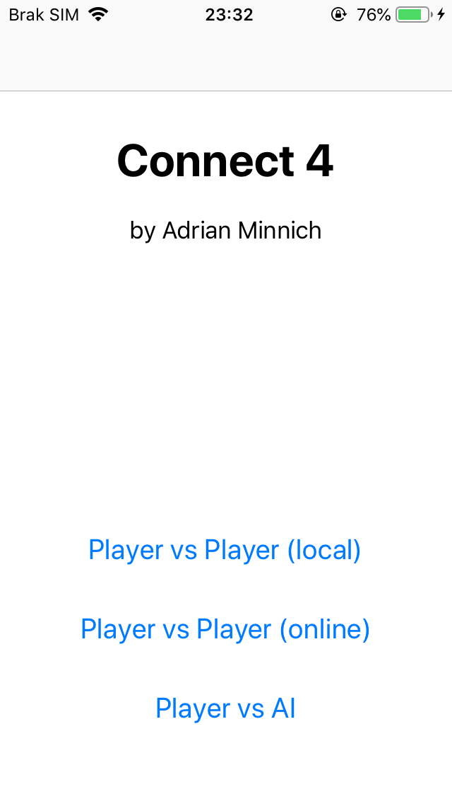
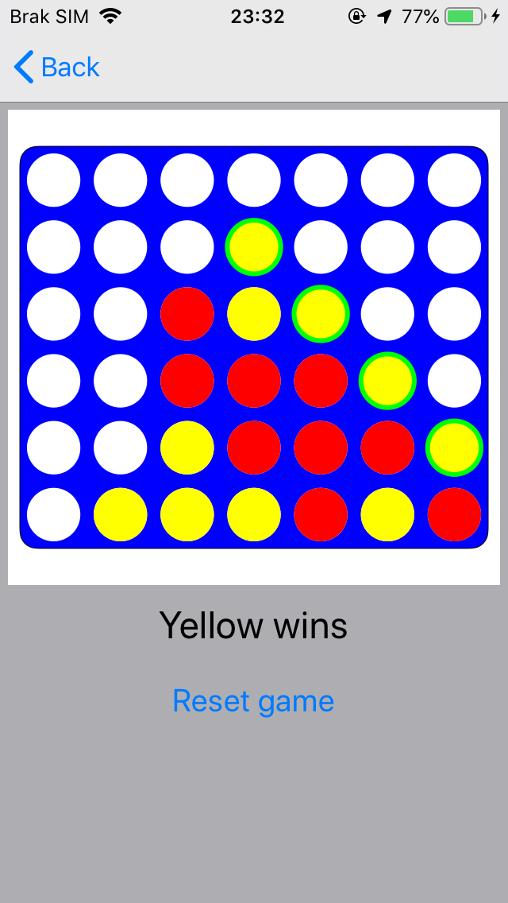
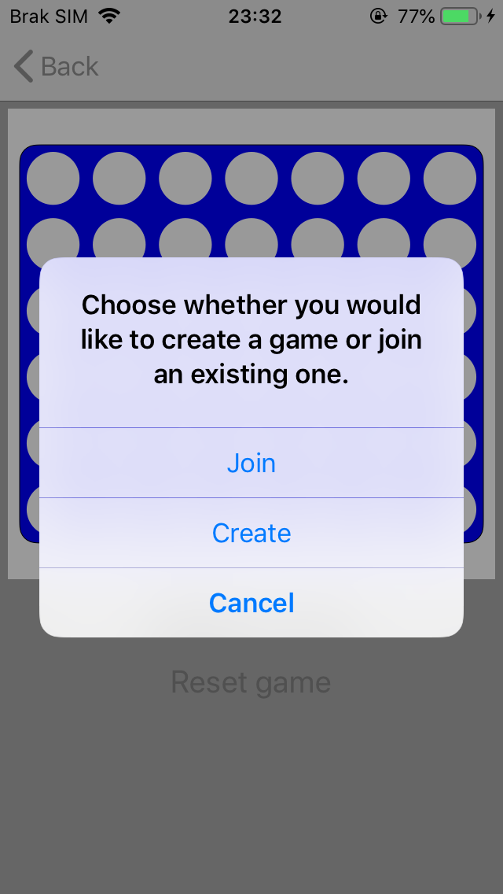

# Connect4
Connect4 game made in Swift using UIKit

Functionalities:
- ability to play with friend on one device
- ability to play with friend using peer to peer connection

TO DO:
- implement player vs AI game using minimax (alpha-beta) algorithm
- implement behaviour for draw
- fix dropping pieces in peer-to-peer game (one player can drop both player pieces)

